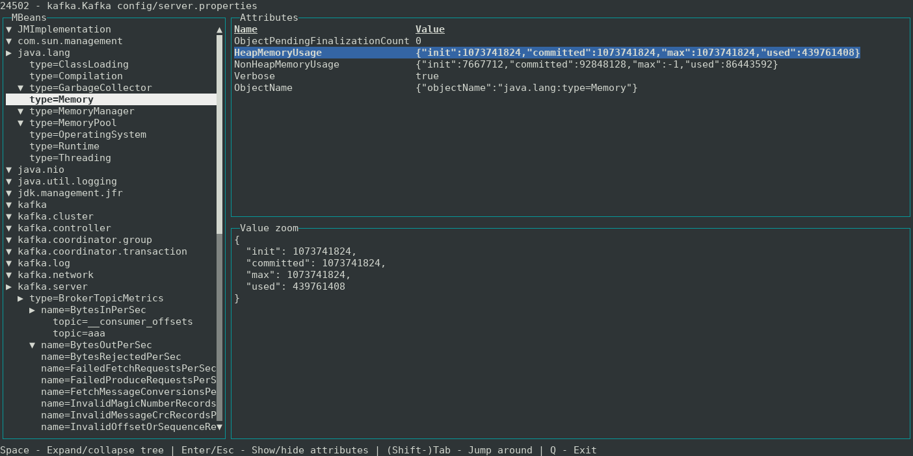

# JMXViewer
Terminal UI JMX (Java management extension) viewer



# Usage
```shell
java -jar jmxviewer.jar [pid]
```

The PID is optional. If it is not provided, the application will show you the selection window.

You can download `jmxviewer.jar` from the [Releases](https://github.com/ivanyu/jmxviewer/releases) section, the size is about 570 KB.

# Limitations

- MBean operation execution is not supported at the moment.
